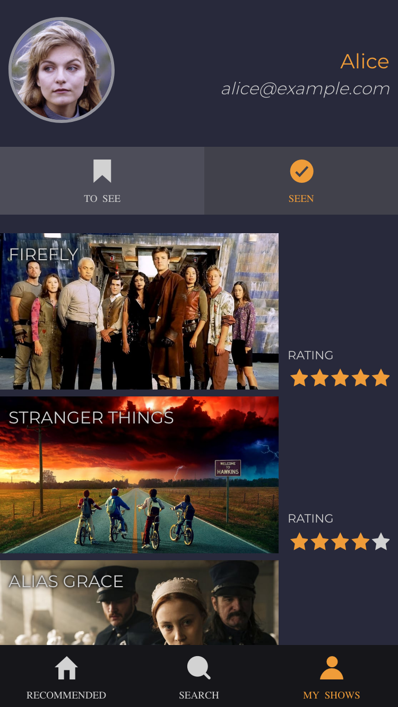

# What's next

_What's next_ is an app for tracking your favourite TV shows as well as discovering new ones based on the ones you like.

## Contribution

Took over the project from @1334 and added authentication to the front end and test coverage to the back end resulting in over 90% coverage [report](.server/coverage/lcov-report/index.html).

```
-----------------------------|----------|----------|----------|----------|-------------------|
File                         |  % Stmts | % Branch |  % Funcs |  % Lines | Uncovered Line #s |
-----------------------------|----------|----------|----------|----------|-------------------|
All files                    |      100 |      100 |      100 |      100 |                   |
 thirdPartyAuthentication.js |      100 |      100 |      100 |      100 |                   |
-----------------------------|----------|----------|----------|----------|-------------------|
Test Suites: 1 passed, 1 total
Tests:       58 passed, 58 total
Snapshots:   0 total
Time:        7.361s
Ran all test suites related to changed files.
```

## Screenshots

<div>
   &nbsp;&nbsp;
   &nbsp;&nbsp;
  
</div>

## Getting started

In order to run the app you need to `npm install` on both the client and server folders and get a Movie DB API key, you can find all the information on how to do that [here](https://www.themoviedb.org/documentation/api).

With the key save it in a `.env` file on the `/server/` folder under as `API_KEY`.

After making sure that PostgreSQL is up and running on your machine run `cd server && npx sequelize db:create && npm run recreateDb` in order to put the DB in its initial state.

With that run on two different tabs the client and the server.
From the rooot of the project, type `cd client && ng serve` to run the client and `cd server && node index.js` to run the server. With that the app will be accessible on `http://localhost:4200`.

## Tech stack

The tech stack used to build this app is:

- The frontend is an Angular app and all the styling is done with Sass
- The backend is an expreess server backed up by a PostgreSQL db with Sequelize as an ORM.
- All the data comes from [The Movie DB](https://www.themoviedb.org) API.
